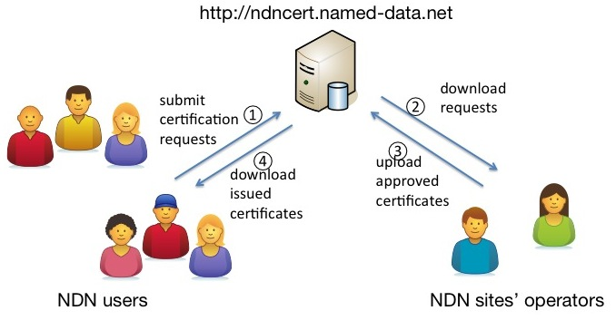

OpenMHealth Cert Website
=======

Utilities to facilitate public key certificate management for NDNFit/OpenMHealth applications. 
Based on [ndncert](https://github.com/named-data/ndncert), and [Jiewen's fork](https://github.com/alanwaketan/ndncert).

If set

    AUTO_APPROVE = True

in settings.py, all requests would be automatically approved; otherwise, ndnop-process-requests would be needed;

Operator(s) should have /org/openmhealth as their default identity; and if set to AUTO_APPROVE, the host on which the site runs should have /org/openmhealth as its default identity; please check with

    ndnsec-get-default

## Name conventions for NDN certificates

User's assigned namespace is randomly generated;

User data namespace may look like

    /org/openmhealth/keGKRFc81p2dkn0ebp9VgLdlJzSfJ0DKGvu1t0PGMCQZWnUcVmj2g9cAEVnH

Certificate name may look like

    /org/openmhealth/KEY/keGKRFc81p2dkn0ebp9VgLdlJzSfJ0DKGvu1t0PGMCQZWnUcVmj2g9cAEVnH/ksk-1438305472389/ID-CERT/%FD%00%00%01N%E1%AF%EB%5E

## Web/Mobile app interface

<table>
  <tbody>
    <tr>
      <th>URL</th>
      <th>Method</th>
      <th>Parameter</th>
      <th>Action</th>
    </tr>
    <tr>
      <td>/, /tokens/request</td>
      <td>GET</td>
      <td>None</td>
      <td>Web user facing, render token request site Return: 200</td>
    </tr>
    <tr>
      <td>/, /tokens/request</td>
      <td>POST</td>
      <td>email</td>
      <td>User facing, generate and store user token and namespace; Return: 200: {“status”: 200}, success</td>
    </tr>
    <tr>
      <td>/cert-requests/submit/</td>
      <td>GET</td>
      <td>email, token</td>
      <td>Web user facing, render certificate submit page Return: 200</td>
    </tr>
    <tr>
      <td>/cert-requests/submit/</td>
      <td>POST</td>
      <td>email, token, full_name, cert_request</td>
      <td>
        User facing, store user info and cert request for given token; 
        Return: 
        200: {“status”: 200}, success 
        403: no token/email record 
        500: no operator, error during ndnsec-certgen 
        400: user name empty, malformed cert request, cert name does not match assigned name 
      </td>
    </tr>
    <tr>
      <td>/cert-requests/get/</td>
      <td>POST</td>
      <td>commandInterest</td>
      <td>
        Operator facing, list cert requests for certain operator; 
        Return: 
        200, list of pending cert requests 
        403, operator record not found 
      </td>
    </tr>
    <tr>
      <td>/cert/submit/</td>
      <td>POST</td>
      <td>data, email, full_name</td>
      <td>
        Operator facing, store signed certificate and notify user for downloading; 
        Return: 
        200, cert approved; 
        400, mandatory field missing, to-add: submitted data verification failed; 
        500, operator not found; 
        403, no cert request entry; 
      </td>
    </tr>
    <tr>
      <td>/cert/get/</td>
      <td>GET</td>
      <td>name, isView(optional)</td>
      <td>
        User facing, get certificate using certificate name; 
        Return: 
        200, NDN cert data; 
        404, no such certificate; 
      </td>
    </tr>
  </tbody>
</table>

## Basic operations

### User view

To obtain a valid NDN testbed certificate, user should follow the following steps:

* Go to http://ndncert.named-data.net, initiate certification by submitting email address

    

* Check mailbox and click to open certification submission page

    

* Generate certification request in the specified namespace (derived from email)

    

* Submit name, other information to associate with the certificate, and public key

    

* Wait for email notification of the approval by the site’s operator

    

* Follow the instructions to install the issued certificate

    

After final step the NDN Testbed certificate is installed and ready to be used.

### Site operator view

Whenever users submit certification requests, operators are getting notified via email. The
following highlights steps operators need to perform to issue or deny certification:

* Wait for notification about users’ certification request(s)

    

* Log in (ssh) to the certification host

    

* Run `ndnop-process-requests` command and make decisions to approve/reject request

    

    If `ndnop-process-requests` is missing, it can be downloaded using

        curl -O https://raw.githubusercontent.com/named-data/ndncert/master/ndnop-process-requests
        chmod 755 ndnop-process-requests

        # Optionally copy to a folder within $PATH. For example:
        sudo mv ndnop-process-requests /usr/local/bin/
